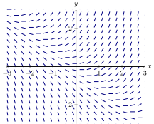

# Differential equations

**example:**
$$ a = kx$$
$$\frac{d²x}{dt²}=kx$$
$$\frac{dy}{dx}=f(x,y)$$
**variable- separable differenial equation**
$$\frac{dy}{dx}=g(x)h(y)$$
$$\int\frac{1}{h(y)}=\int g(x)dx$$

## Population growth model

$$P=P_0e^{kt}$$
$$t_0=0$$
$$\frac{dP}{dt}=kP$$
$$\frac{dP}{dt}=g(P)h(t)$$
We place P on one side and ts on the others
$$\int\frac{1}{P}dP=\int k dt$$
$$ln|P|=kt+C$$
$$|P|=e^{kt+C}$$
$$P=e^{kt}e^C$$
$$P=P_0e^{kt}$$

## Direction field

## Orthogonal functions

$$x=ky$$
$$1=ky\frac{dy}{dx}$$
$$\frac{dy}{dx}=\frac{1}{2ky}$$
$$\frac{dy}{dx}=\frac{1}{\frac{xy}{y²}}$$
$$\frac{dy}{dx}=\frac{y}{2x}$$
$$\frac{dy}{dx}=-\frac{2x}{y}$$
$$\frac{y²}{2}+x²=C$$
### Example:

$$\frac{dy}{dt}
