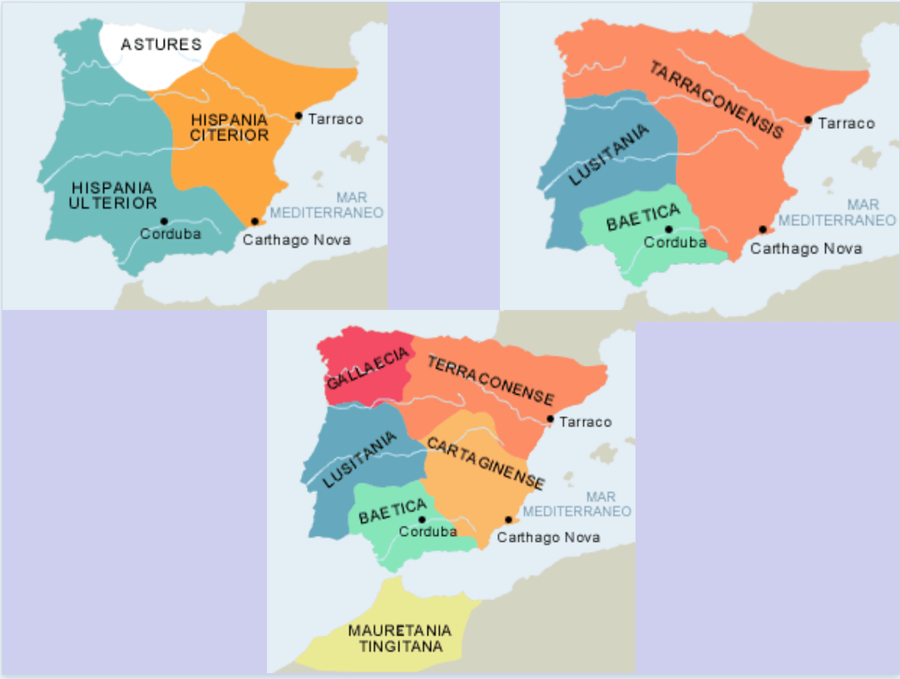
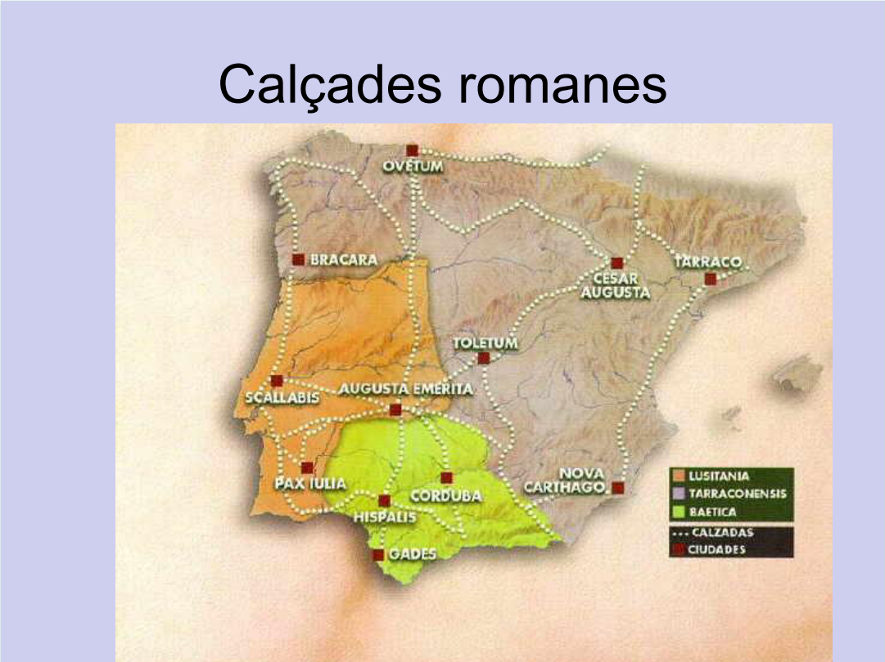
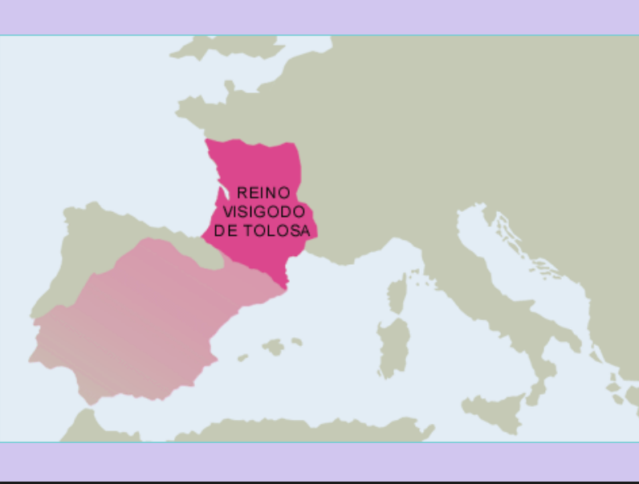
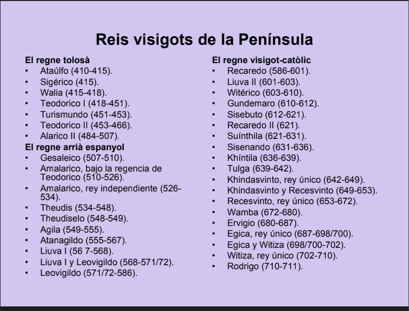
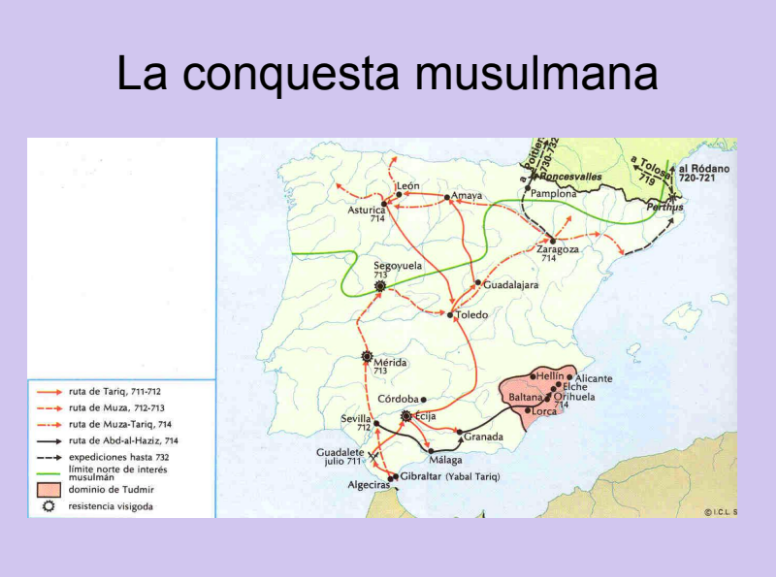
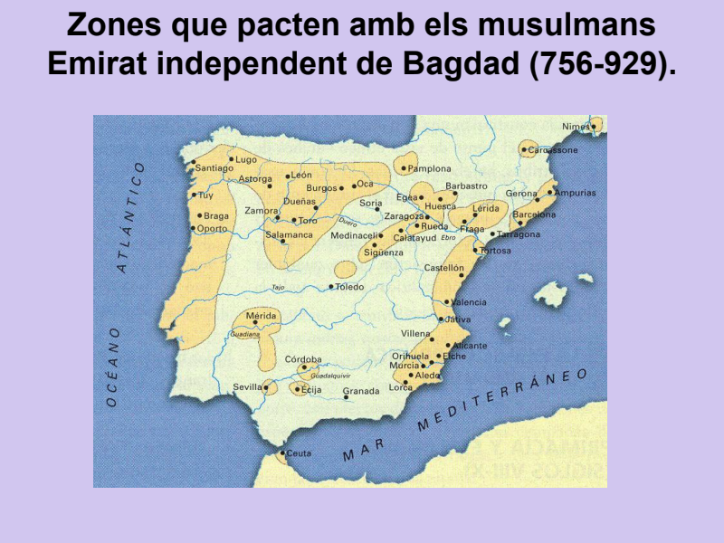
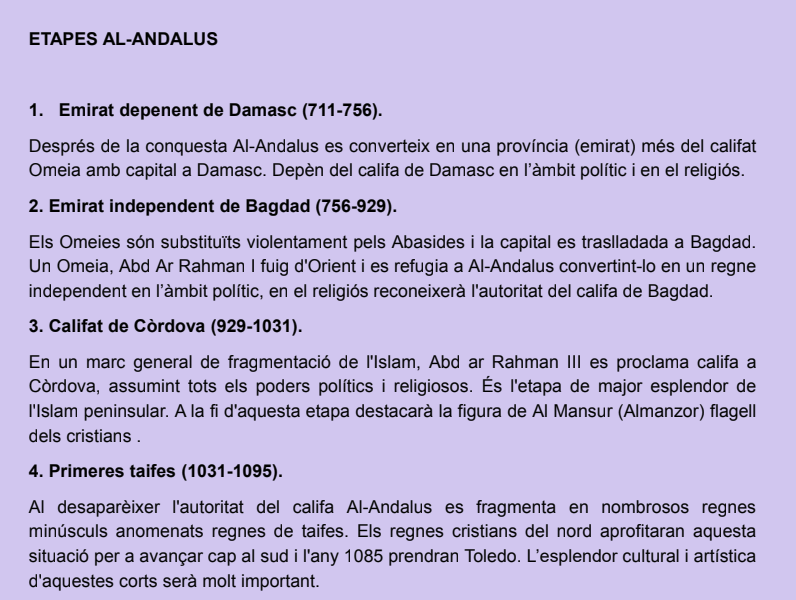
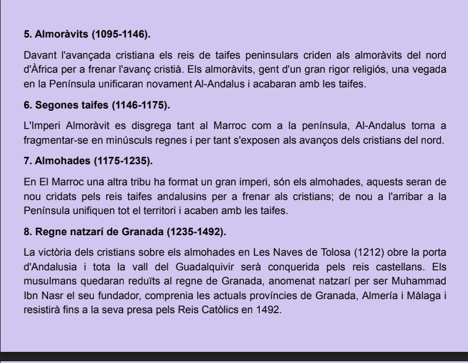
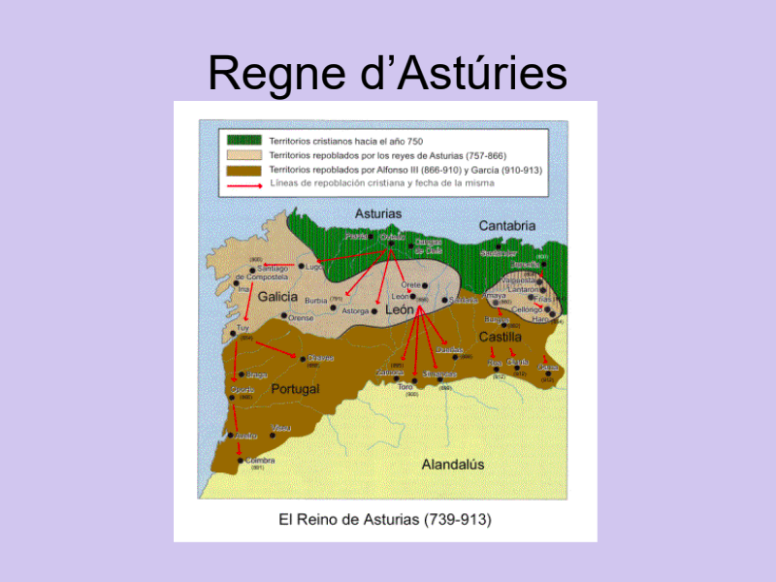
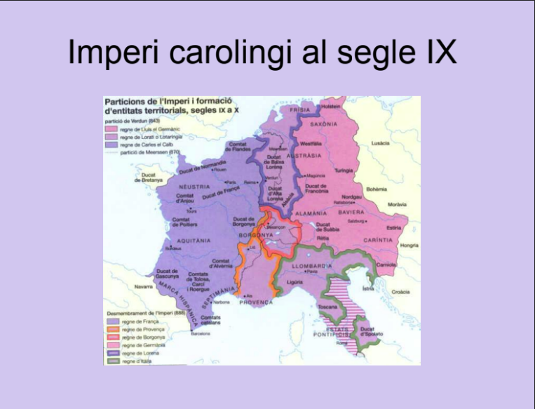

# Tema 1

Class: Historia
Created: Sep 18, 2019 8:10 AM
IB: No
Last edit: Oct 09, 2019 4:55 PM
Materials: https://www.notion.so/Tema-1-b0264e588010471faf27a6e97ab9eed5#07d1bc81b8334738b36a7908d921c26d
Reviewed: No
Sele: No
Type: Apuntes

[https://drive.google.com/open?id=1zr7KMmVEBPGpX24cfnkm4tMHMDymg4Gm](https://drive.google.com/open?id=1zr7KMmVEBPGpX24cfnkm4tMHMDymg4Gm)

# Guerres Puniques

## 1ª guerra

## 2ª guerra

## 3ª guerra

- Anibal perd

# Conquesta cartaginesa a Iberia

Assalten

# Conquesta romana a Iberia

- Ibers derrotats amb facilitat
- Celtiber cauen amb dificultat
- Celtes cauen amb moltes dificultats

## Viriat

Lider simbol de la resistencia que mor enverinat durant la conquesta. 

## "surgeix la guerra de guerrilles

guerra on un grup paramilitar lluita contra un militar aprofitan el terreny.

## Numantia

Defensa de la ciutat amb muralles

Durant la dictadura es mitifiquen aquestes figures

## Fi de la guerra

La peninsula te la triada mediterrana(cereal, vi i oli

1. m

# Sortida dels romans

Ens deixen restes.

## Motius caiguda imperi

- Fronteres massa grans
- Corrupció y lluites internes
- Major esclavitut
- Cristianisme

## Fi

496 mor l'ultim emeperador.

# visigodos

El lider Ataulf es casa amb la germana de l'emperador. Arriba a la peninsula

Els francs els forçen a la peninsula

Assamblearis fins al catolicisme

## Estabilitat

Mantenint l'estructura romana i passant-se al catolicisme com el poble.

Els visigots faran lleis aplicables a la peninsula basades en el dret romà.

# Conquesta musulmana

proces d'aculturacio molt rapid degut als beneficis fiscal que comportava ser musulans.

Al 1212 Navas de tolosa es la unica creuada al territori europeu

# Perspectiva cristiana

# Reconquesta

Al llarg del segle X bBarcelona es produeixen les ratzies.

El comtat de Barcelona demana proteccio al regne pero degut a:

- Manca de vassallatge
- no pagen imposto
- repartició dels comtats sense consultar al rei

No s'envia tropes i es declaren independet

## Indepedencia comtats

Es casa petronella amb el casal de Barcelona i es crea la comfederació formada pel regne d'Arago i els comptatss Catalans que anomenarem la Corona

## Reis catolics

Matrimoni va crear unaunió dinastica que posteriorment portaria al austries

# Els Austries

## Carles 1

Problemes a espanya

Revolució:

- Comuner:
- Germanies

### Comuners

Causa:

- Us dels diners per a la politica al extranger
- Rei extrangers

Q demanen:

- Menys impostos
- Més castellans a la cort

### Germanies

Causes:

- 

## Guerra contra els otomans

Arriben fins a viena

## Guerres contra els protestants

Pau d'Ausburg permet el protestantisme

## Felip II

### Complot

Assesinen a un conseller

# Excercit español

Decidit pel compte duc d'olivares

## Unio d'armes

# Carles II

mor sense successió

# Guerra de successió

Caiguda de barcelona desencadena la creació d'España

# Monarquía Borbon

S'introdueixen reformes del despotisme illustrada
